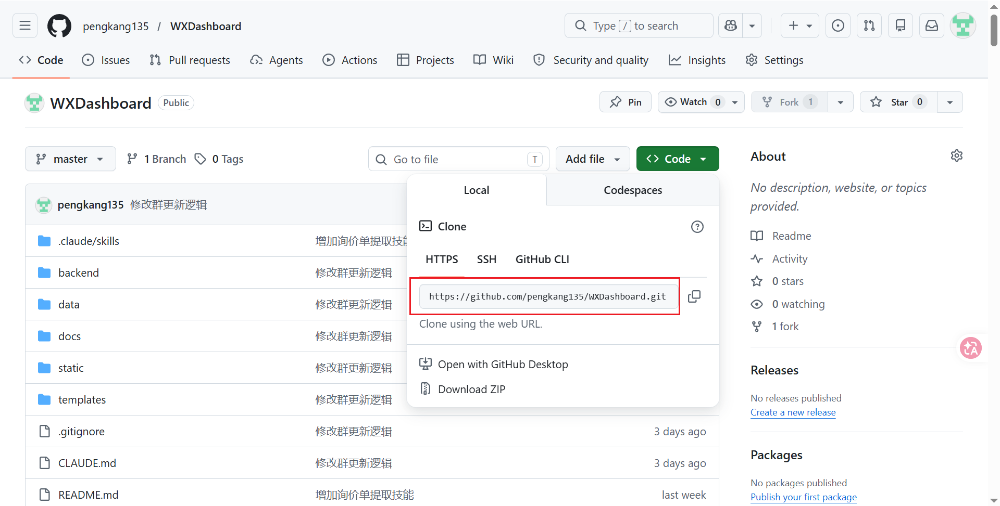
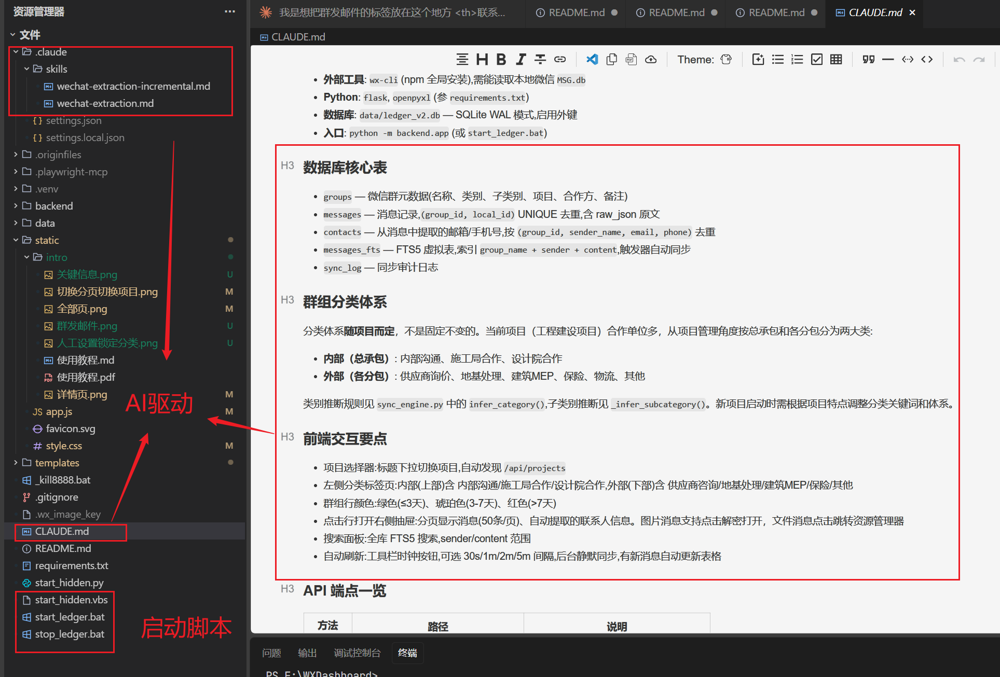
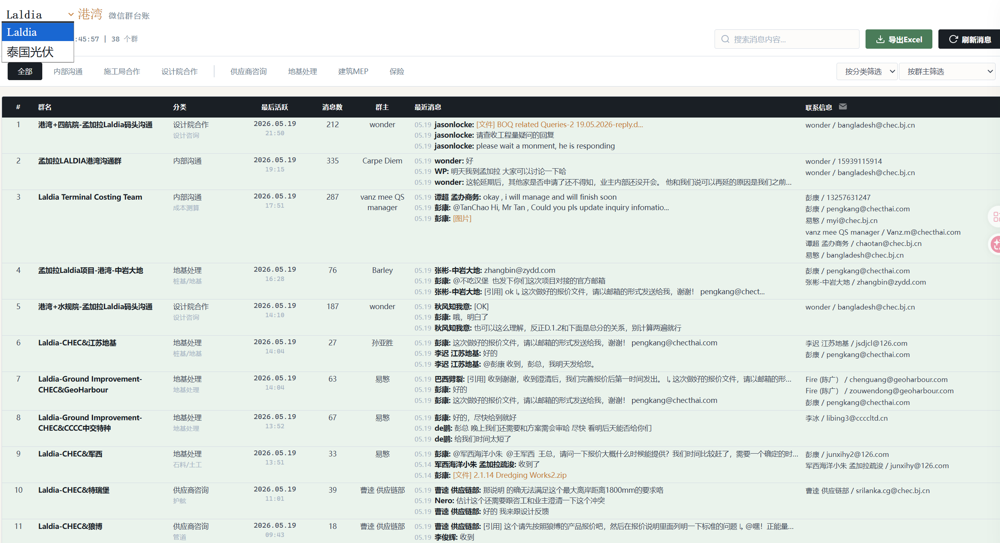
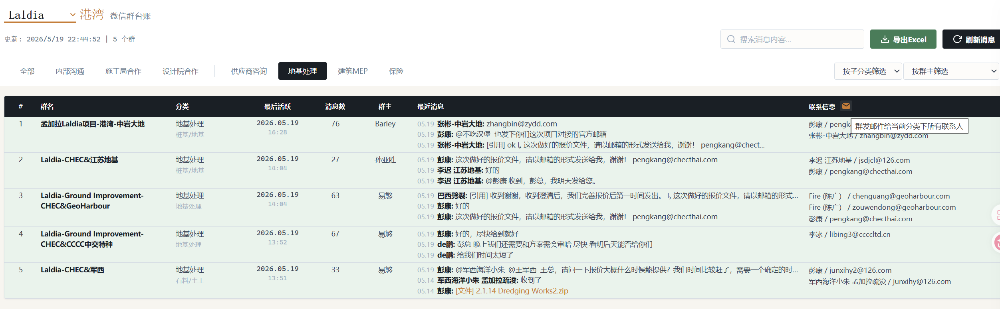
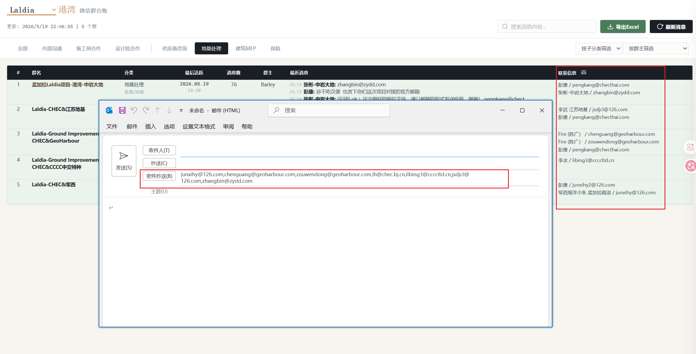
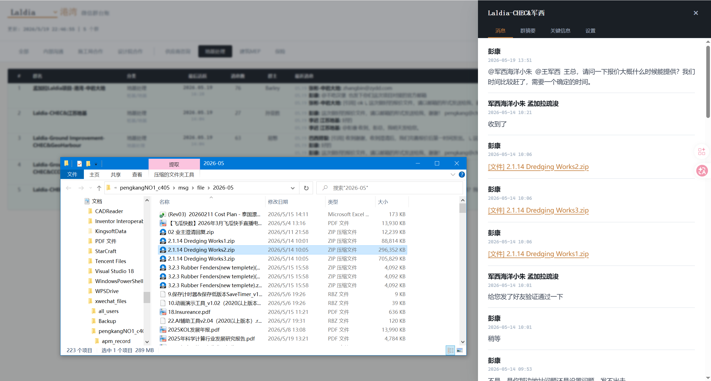
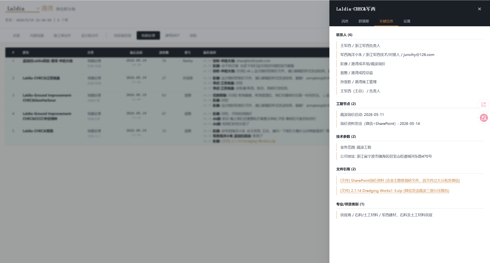
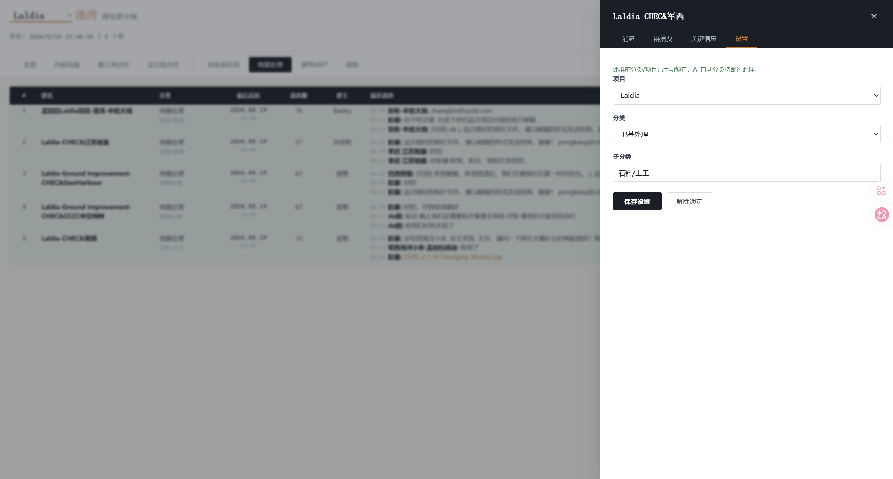
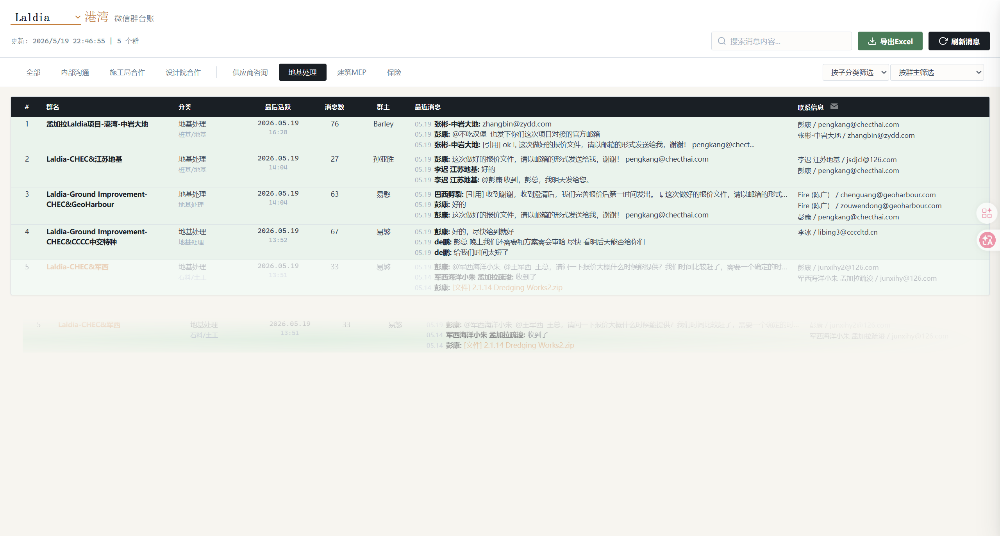

# WXDashboard 使用教程

WXDashboard 是一个微信群消息管理工具。它可以把微信工作群里的聊天记录整理成方便浏览、搜索和导出的台账。

如果你是第一次使用，请从头到尾按顺序阅读。本教程假设你对电脑的基本操作（打开文件、双击、复制粘贴）已有了解。

---

## 零、安装与配置



### 你需要准备

- **Python 3.9+**（建议 3.11）
- **Node.js 14+**
- **微信桌面版 4.x**（已登录）
- **Git**（用于下载项目）

### 下载项目

打开命令行（PowerShell 或 CMD），执行：

```bash
git clone git@github.com:pengkang135/WXDashboard.git
cd WXDashboard
```

### 安装 Python 依赖

```bash
python -m venv .venv
.venv\Scripts\python -m pip install flask openpyxl
```

### 安装并初始化 wx-cli

wx-cli 是读取微信消息的命令行工具，通过 npm 安装：

```bash
npm install -g @jackwener/wx-cli
```

安装完成后，确保微信正在运行且已登录，然后执行初始化（提取微信数据库密钥）：

```bash
sudo wx init
```

初始化只需执行一次。之后所有命令无需 sudo。

> 如果在 macOS 上遇到签名问题，需先对微信重新签名：
>
> ```bash
> codesign --force --deep --sign - /Applications/WeChat.app
> ```

### 验证安装

```bash
wx sessions --json
```

如果正常输出会话列表（JSON 格式），说明 wx-cli 已配置成功。

### 注册守护任务（重要）

为防止 wx-cli 进程残留导致微信封号，需要注册 Windows 计划任务：

```powershell
powershell -ExecutionPolicy Bypass -File scripts\register_wx_guardian.ps1
```

该任务每 2 分钟自动扫描并清理残留的 wx-cli 进程。

---

## 一、如何启动系统



### 启动方法（二选一）

**方法一：桌面模式（推荐新手使用）**

在项目文件夹里找到 `start_ledger.bat`，双击运行。

- 屏幕上会出现一个黑色窗口，显示启动进度。
- 启动完成后，会自动打开浏览器，进入系统首页。
- 黑色窗口**不要关掉**，关闭它系统就停了。
- 用完想关闭时，在黑色窗口里按键盘上的 `Ctrl + C`，然后关掉窗口即可。

> 小提示：这个方法会一直有一个黑色命令行窗口在任务栏上，如果不喜欢，可以用方法二。

**方法二：后台静默模式（无窗口）**

双击运行 `start_hidden.vbs`，没有任何窗口弹出。

- 启动过程完全在后台运行。
- 稍等几秒（等后端启动），手动打开浏览器，在地址栏输入 `http://127.0.0.1:8888` 并回车。
- 用完想关闭时，双击 `stop_ledger.bat`。

### 打开系统

无论用哪种方法启动，最终都是在浏览器里使用。打开浏览器，确认地址栏显示的是 `http://127.0.0.1:8888`，看到页面标题为"港湾微信群台账"，就说明启动成功了。

> 如果页面打不开，先检查：
>
> 1. 黑色窗口是否还在运行？（方法一）
> 2. 地址栏输入是否正确？必须包含 `http://` 开头。

---

## 二、主界面概览



进入系统后看到的页面就是**主界面**。它分为三个区域，从上到下依次是：

### 顶部工具栏

顶部有一排按钮和输入框：

- **项目切换** — 页面标题旁边有一个下拉框（写着项目名称，比如"Laldia"）。点它可以切换到不同的项目，每个项目的群和数据是分开管理的。
- **搜索框** — 带有"搜索消息内容..."提示文字的输入框。在这里输入关键词，按键盘 `Enter` 键，就能在所有群的消息里搜索这个词。搜索结果会从右侧滑出。
- **导出 Excel** — 点击这个按钮，会把当前看到的群组数据导出成一个 Excel 文件，方便用 Office 或 WPS 打开查看。
- **刷新消息** — 点击这个按钮，系统会从微信里拉取最新的消息。同步过程中会弹出一个进度提示窗口。

### 分类标签栏

工具栏下方是一排标签按钮：

| 标签位置       | 标签名称                            |
| -------------- | ----------------------------------- |
| 内部（总承包） | 内部沟通、施工局合作、设计院合作    |
| 外部（各分包） | 供应商咨询、地基处理、建筑MEP、保险 |

- **全部**标签显示所有群，默认选中。
- 点击某个标签，表格就只显示对应分类的群。
- 标签旁边还有"按分类筛选"和"按群主筛选"两个下拉框，可以更精细地筛选。

### 数据表格

分类标签下方是一张大表格，每行代表一个微信群。各列的含义：

| 列名     | 说明                                                                                                                          |
| -------- | ----------------------------------------------------------------------------------------------------------------------------- |
| #        | 序号                                                                                                                          |
| 群名     | 微信群的名字。**点击群名**可以打开详情面板（见第五章）                                                                  |
| 分类     | 该群属于哪个分类                                                                                                              |
| 最后活跃 | 群里最后一次发消息的日期。颜色代表活跃程度：**绿色**=3天内有人发言，**橙色**=3到7天，**红色**=超过7天没动静 |
| 消息数   | 该群已收录的消息总条数                                                                                                        |
| 群主     | 微信群的创建者                                                                                                                |
| 最近消息 | 最近 3 条消息的简单预览（时间、谁发的、内容开头）                                                                             |
| 联系信息 | 从消息中自动找到的邮箱和电话号码                                                                                              |

---

## 三、切换项目与分类筛选



### 切换项目

如果系统管理了多个项目，可以点击标题旁的下拉框，选择你想看的项目。切换后：

- 分类标签会变成当前项目的分类。
- 表格只显示该项目的群。
- 搜索也只搜索当前项目里的消息。

### 分类筛选

点击分类标签（如"地基处理"），表格只显示该类别的群。这样当你只关心某个类别的群时，可以快速过滤。

标签旁边的两个下拉框可以进一步筛选：

- **按分类筛选**：和点击标签效果一样。
- **按群主筛选**：按群的创建者来过滤，方便找某人创建的群。

### 群发邮件（重要功能）

当选中某个分类后，表格顶部"联系信息"列的标题旁边会出现一个**邮件图标按钮**。

点击它，系统会自动收集当前分类下所有联系人的邮箱地址，然后打开电脑上默认的邮件软件（如 Outlook），把所有邮箱填入"密件抄送"栏。你只需写好邮件正文，点发送就可以一次性给所有相关联系人发邮件。

> 注意：使用这个功能需要电脑上装了邮件软件（Outlook 等），并且已配置好邮箱账户。

---

## 四、群发邮件



群发邮件功能的操作步骤：

1. **选择分类**：先点击左侧的某个分类标签（比如"地基处理"）。
2. **点击邮件按钮**：在表格右上角"联系信息"列标题旁，点邮件图标。
3. **自动填好收件人**：系统会自动打开邮件软件，把所有联系人的邮箱填入密件抄送。
4. **写正文并发送**：在邮件软件里写好标题和正文，点发送即可。

这样就不需要手动去一个个复制粘贴邮箱地址了。

---

## 五、查看群组详情



在主界面表格中**点击任意群名**，右侧会滑出一个详情面板。这个面板分为四个标签页：

### 5.1 消息

显示群里的聊天记录，按时间从新到旧排列（最新在最上面），每页 50 条。

每条消息包含：

- **发送时间**：什么时候发的
- **发送人**：谁发的
- **消息内容**：发了什么文字

如果是图片消息，会显示缩略图，点击可以放大查看。

如果是文件消息（Word、Excel、PDF、压缩包等），点击可以直接在资源管理器（文件夹）中打开文件所在位置，方便查看和使用。

底部有翻页按钮，可以浏览更早的消息。

### 5.2 群摘要

如果该群的消息超过 50 条，AI 会自动生成群聊摘要。每条摘要包含日期范围和内容总结，帮你快速了解群里最近都在讨论什么。

### 5.3 关键信息

AI 从聊天记录里自动提取的重要信息，按类型分好类展示（详见第六章）。

### 5.4 设置

对群进行分类和属性设置（详见第七章）。

---

## 六、关键信息提取



AI 会自动从群聊中抓取有价值的信息，整理好放在"关键信息"标签页里。提取的内容分为以下几类：

- **联系人** — 公司名、职位、联系方式（邮箱和手机）。格式："微信名 / 公司/职位 / 邮箱"。
- **工期节点** — 项目里约定的时间节点和里程碑。
- **技术参数** — 规格、标准、指标数值等专业信息。
- **文件引用** — 聊天中提到的文件、图纸编号和版本。
- **专业/供货类别** — 供应商提供的产品或服务类别。

这些信息是 AI 自动提取的，不需要手动填写。在群详情面板里切换到"关键信息"标签页就能看到。

---

## 七、人工设置与锁定分类



AI 会自动给群分类，但有时候你需要手动调整。在群详情面板的"设置"标签页里可以操作：

- **项目** — 把群分配到正确的项目（下拉选择）。
- **分类** — 选择大类（内部 / 外部）。
- **子分类** — 选择具体的子分类（如"地基处理"）。

修改完成后，点击**"保存设置"**。

保存后，这个群的分类就被"锁定"了。AI 的自动分类不会再改动它。页面上会提示"此群的分类/项目已手动锁定"。

如果想恢复让 AI 自动管理，点击**"解除锁定"**即可。

还可以手动拖动修改



> 提示：如果你不确定该选哪个分类，可以先不设置，让 AI 自动分类。等确定后再来手动调整。

---

## 八、安全注意事项

### 为什么安全很重要

微信有反作弊检测机制。如果检测到第三方程序持续读写微信数据库，会**强制退出微信、踢下线，严重时封号**。本项目已两次被踢下线，因此安全规则是硬性要求，不容违反。

### 核心安全规则

**1. wx-cli 进程生命周期**

- daemon 和 wx-cli 子进程**仅在同步时短暂运行**，同步结束后必须全部退出
- `sync()` 函数通过 `try/finally` 保证：无论同步成功还是失败，daemon 都会被强制终止
- **任何情况下，同步结束后不应有任何 wx-cli 进程存活**

**2. wx-cli 调用权**

- **只有 `backend/sync_engine.py` 可以调用 wx-cli**
- AI（Claude Code）、子 Agent、任何脚本均不得直接调用 wx-cli
- AI 需要读取消息时，必须通过 SQLite 数据库（`data/ledger_v2.db`）

**3. 频率控制**

- 两次 wx-cli 调用间隔至少 **1.5 秒**
- 不同群之间随机延迟 **3-8 秒**
- 每日调用上限 **200 次**（通过计数器文件 `data/wx_call_counter.json` 跟踪）
- 单次拉取最多 **500 条**消息

**4. 守护任务**

- Windows 计划任务 `wxGuardian` 每 2 分钟扫描一次
- 自动终止运行超过 3 分钟的 wx-cli 进程
- 这是防止进程残留的最后一道防线

**5. 禁止并行**

- 任何时候不得同时运行两个 wx-cli 调用
- 同步过程中前端如果再次点击"刷新消息"，会提示"同步已在执行中"

### 如果被踢下线

如果微信突然退出或提示"账号异常"：

1. 立即关闭所有终端和 Flask 进程
2. 手动运行一次守护脚本：`python scripts\wx_guardian_silent.py`
3. 重新登录微信
4. 等待至少 **10 分钟**后再重新启动系统
5. 不要短时间内反复启动同步

---

## 九、常用操作流程总结

```
第一步：双击 start_ledger.bat，启动系统
              ↓
第二步：在顶部下拉框选择要看的项目
              ↓
第三步：点击分类标签，只看关注的那类群
              ↓
第四步：点击某个群名，在右侧查看聊天记录
              ↓
第五步：切换到"关键信息"标签页，查看 AI 提取的重要信息
              ↓
第六步：选中分类 → 点击邮件按钮 → 群发邮件给该分类下所有联系人
              ↓
第七步：点击"导出 Excel"，把当前数据导出为表格文件
```

## 常见问题

**问：页面打不开怎么办？**

答：先确认 `start_ledger.bat` 的黑色窗口是否还开着。如果关了，重新双击运行一次。如果还开着但页面打不开，检查地址栏是否输入了 `http://127.0.0.1:8888`（注意是英文冒号和斜杠）。

**问：消息没有更新怎么办？**

答：点击顶部的"刷新消息"按钮，系统会自动拉取微信最新消息。同步需要几十秒到几分钟，请耐心等待进度提示。

**问：搜索不到想要的内容？**

答：搜索框输入关键词后需要按 `Enter` 键才会开始搜索。搜索范围包括群名、发送人和消息内容。如果还是搜不到，可能是该消息还没有同步到系统中，先点"刷新消息"再试。

**问：群发邮件没反应？**

答：先确认电脑上装了邮件客户端（如 Outlook），并且已经添加了邮箱账户。如果没有，Windows 自带的"邮件"应用也可以。
