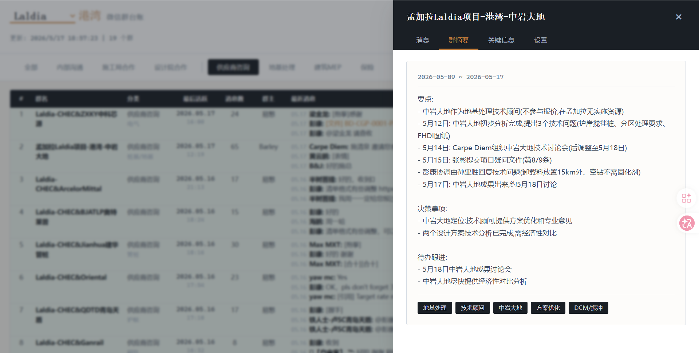

# WXDashboard User Guide

WXDashboard turns WeChat work group chats into a structured, searchable, filterable ledger. This guide walks through the core features using three screenshots.

---

## 1. Main Dashboard (Overview)


After opening `http://127.0.0.1:8888`, the interface is divided into three sections top to bottom:

### Top Toolbar

- **Project Switcher** — The dropdown next to the title switches between projects. Each project manages its own groups and data independently.
- **Search** — Full-text search across group names, senders, and message content. Results appear in a slide-out panel on the right.
- **Export Excel** — Downloads the current filtered view as `.xlsx`. Columns match the page exactly. Filename format: `WXGLedger_Project_Category_Date.xlsx`.
- **Refresh** — Incrementally pulls the latest WeChat messages. Sync progress is shown in a modal dialog.

### Category Tabs

Groups are organized into two top-level categories based on project structure:

| Top-Level | Subcategories |
|-----------|---------------|
| Internal (General Contractor) | Internal Comms, Construction Bureau, Design Institute |
| External (Subcontractors) | Supplier Inquiry, Foundation, Building MEP, Insurance, Logistics |

Click a tab to filter groups by category. The "All" tab shows every group.

### Data Table

The table displays key information for each group:

| Column | Description |
|--------|-------------|
| # | Row number |
| Group Name | WeChat group name — click to open the detail drawer |
| Category | Category and subcategory |
| Last Active | Date of the most recent message. Color indicates recency (green ≤3 days, amber 3-7 days, red >7 days) |
| Messages | Total synced message count |
| Owner | Group creator |
| Recent Messages | Preview of the 3 most recent messages (time, sender, content excerpt) |
| Contacts | Emails and phone numbers automatically extracted from messages |

---

## 2. Project Switching & Category Filtering


### Switching Projects

Select a different project from the title dropdown. The page refreshes automatically:
- Category tabs update to match the project
- Only groups belonging to the selected project are shown
- Search scope is limited to the current project

### Filtering by Category

After clicking a category tab:
- The table shows only groups in that category
- Excel export includes only the currently filtered data
- The active tab is highlighted

---

## 3. Group Detail Drawer



Click any group name in the table to open a slide-out drawer from the right, with four tabs:

### Messages

- Paginated view of all messages in the group, newest first (50 per page)
- Each message shows timestamp, sender, and content
- Navigate through history with pagination controls
- Image and file messages appear as clickable links that open in WeChat

### Summary

- AI-generated summaries of group conversations
- Listed newest first, each with a date range and summary text
- Only generated for groups with more than 50 messages

### Extractions

Structured information automatically extracted by AI, organized by type:
- Contact info (company, title, phone/email)
- Technical parameters (specifications, standards, values)
- Schedule milestones (planned dates, key events)
- Document/drawing references (numbers, versions, issue dates)

### Settings

Manually manage group classification:
- **Project** — Change which project the group belongs to
- **Category** — Select top-level category (Internal / External)
- **Subcategory** — Pick a specific subcategory
- **Save** — Locks the classification so the AI will not override it
- **Unlock** — Restores AI auto-management of the group's classification

---

## Typical Workflow

```
Launch app → Select project → Refresh messages (incremental sync)
                    ↓
           Browse category tabs → Click a group name to see details
                    ↓
           Search keywords → Locate specific messages
                    ↓
           Export Excel → Generate ledger report
```
